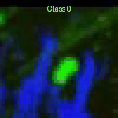
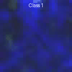

# CBVCC
Metrics and tools for the Cell Behavior Video Classification Challenge (CBVCC): a challenge designed to develop/adapt computer vision methods for classifying videos capturing cell behavior through Intravital Microscopy (IVM).
The primary goal of the CBVCC challenge is to create models that can accurately classify videos based on the movement patterns of cells. Specifically, the models should be able of:

* Identifying videos where cells exhibit sudden changes in their direction of movement.
* Distinguishing these from videos where cells show consistent, linear movement, stationary cells as well as from videos containing only background.

The CBVCC challenge aims to provide a platform for researchers to develop innovative methods for classifying IVM videos, potentially leading to new insights into biological processes. More details are available on the [official challenge page](https://immunemap.org/index.php/challenges-menu/cbvcc).
<p align="center">
  
  
</p>

## Installation instructions

First, clone the CBVCC repository:
```bash
git clone https://github.com/rcabini/CBVCC.git
```
Create a virtual environment with Anaconda:
```bash
conda env create -f environment.yml
conda activate environment
```

## Required Files
To run the full CBVCC analysis pipeline, the following files are necessary:
* CBVCC Video Patches, available [here](https://immunemap.org/index.php/challenges-menu/cbvcc) (`.avi` files), organized as:
```
Dataset/subset/
├── 01/
│   ├── 0/  -> 01_1.avi, 01_2.avi, … (Class 0)
│   ├── 1/  -> 01_5.avi, 01_6.avi, … (Class 1)
├── 02/
│   ├── 0/  -> 02_1.avi, 02_2.avi, …
│   ├── 1/  -> 02_5.avi, 02_6.avi, …
```
Subfolders may represent training, validation, or test sets.
* Tracking Files, available [here](https://immunemap.org/index.php/challenges-menu/cbvcc) (`.csv` files), organized as:
```
Dataset/
├── 01/
│   ├── 0/  -> 01_1.csv, 01_2.csv, … (Class 0)
│   ├── 1/  -> 01_5.csv, 01_6.csv, … (Class 1)
├── 02/
│   ├── 0/  -> 02_1.csv, 02_2.csv, …
│   ├── 1/  -> 02_5.csv, 02_6.csv, …
```
* Submission prediction files of each participating team (e.g., `/uploaded_files/predicted1732199138.csv`)
* CBVCC leaderboard files for Phases 1 and 2 (CSV)

### Labels CSV Generation
The script `metrics/generate_gt.py` generates a CSV containing `.avi` filenames and their class labels (0 or 1), based on subfolder names.

Run the script from the command line specifying dataset root and output CSV:

```bash
python metrics/generate_gt.py /path/to/dataset training_labels.csv
```
### Video quality Metrics Computation
Use `metrics/compute_quality_metrics.py` to compute video quality metrics such as Signal-to-Noise Ratio (SNR) and number of tracked cells (N.TRACKS).

Run the script as:

```bash
python metrics/compute_quality_metrics.py \
  --datasets /path/to/training /path/to/validation /path/to/test \
  --tracks /path/to/tracking_csvs \
  --output output_metrics.csv
```

### Challenge Submissions Evaluation
The script `evaluate_submission.py` evaluates model predictions and generates performance metrics and plots for the validation (Phase 1) and test (Phase 2) phases.

#### Required Inputs

- `--tracks_path`: Path to tracking CSV files
- `--submission1`: Submission CSV for Phase 1
- `--gt1`: Ground truth for Phase 1
- `--submission2`: Submission CSV for Phase 2
- `--gt2`: Ground truth for Phase 2
- `--gt_train`: Ground truth for training set
- `--timestamp_pattern`: Glob pattern for locating submission files (e.g., `/uploaded_files/predicted*.csv`)
- `--quality_csv`: CSV file with precomputed video quality metrics
- `--output_path`: Directory to save output files and plots

#### Outputs

- **CSV Reports**:
  - `evaluation_metrics1.csv` for Validation phase
  - `evaluation_metrics2.csv` for Test phase

- **Plots**:
  - `roc1.png`, `roc2.png`: ROC curves for Validation and Test phases
  - `ncell.png`: Score vs. number of tracked cells
  - `snr.png`: Score vs. SNR
  - `class.png`: Class distribution histogram
  - `metric.png`: Distribution of quality metrics

Run the script as:
```bash
python evaluate_submission.py \
  --tracks_path /path/to/tracks \
  --submission1 /path/to/submission_phase1.csv \
  --gt1 /path/to/gt_phase1.csv \
  --submission2 /path/to/submission_phase2.csv \
  --gt2 /path/to/gt_phase2.csv \
  --timestamp_pattern "/uploaded_files/predicted*.csv" \
  --quality_csv /path/to/quality_overall.csv \
  --gt_train /path/to/train_gt.csv \
  --output_path /path/to/output
```
## Repositories of Participating Methods

Below are the repositories of the methods participating in the challenge:

- **GIMR - Garvan Institute of Medical Research**
  [https://github.com/lxfhfut/TrajNet](https://github.com/lxfhfut/TrajNet)

- **LRI Imaging Core - Cleveland Clinic**
  [https://github.com/yujiahu415/CBVCC](https://github.com/yujiahu415/CBVCC)

- **QuantMorph - University of Toronto**
  [https://bitbucket.org/raymond_hawkins_utor/cbvcc/src/main/](https://bitbucket.org/raymond_hawkins_utor/cbvcc/src/main/)

- **dp-lab - USI**
  [https://github.com/rcabini/CBVCC_CNN](https://github.com/rcabini/CBVCC_CNN)

- **BioVision – University of Central Florida**
  [https://github.com/jkini/CellBehaviorVideoClassification](https://github.com/jkini/CellBehaviorVideoClassification)

## License
The CBVCC repository is licensed under the Apache License 2.0 license. See the file LICENSE for more details.

